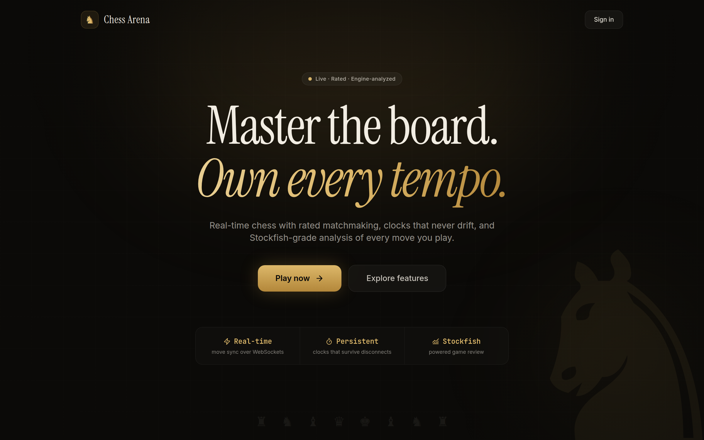
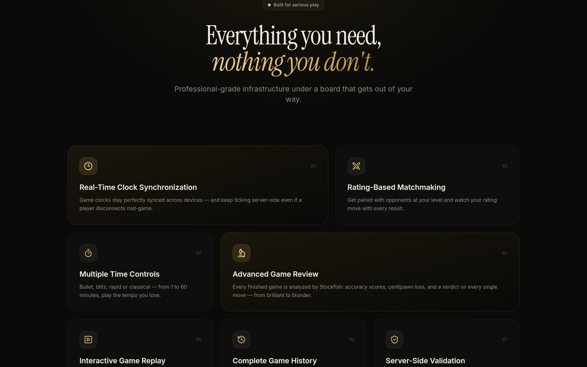
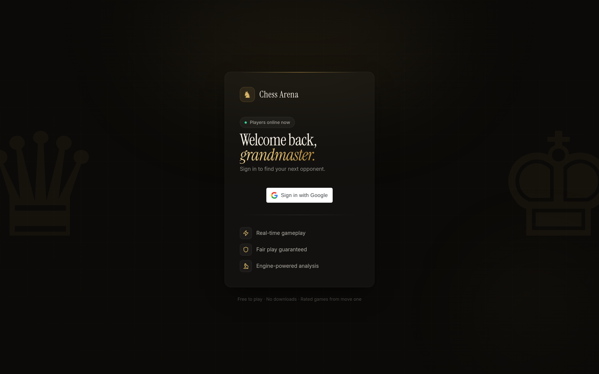
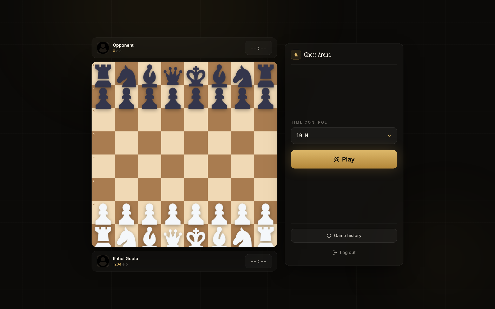
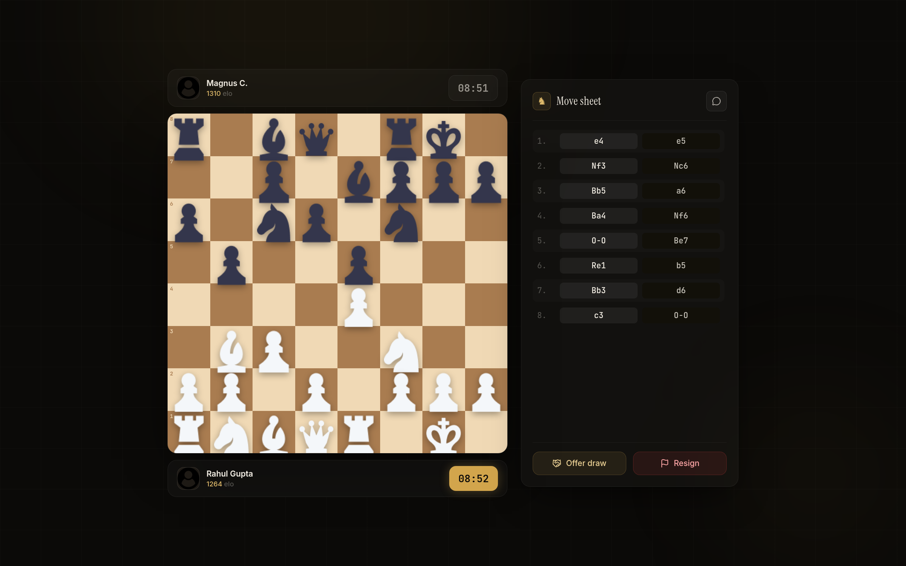
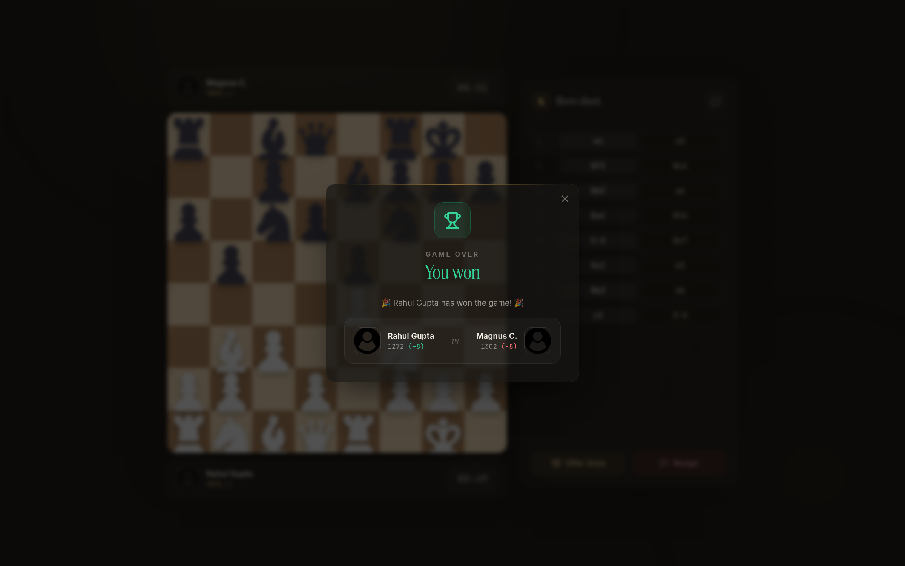
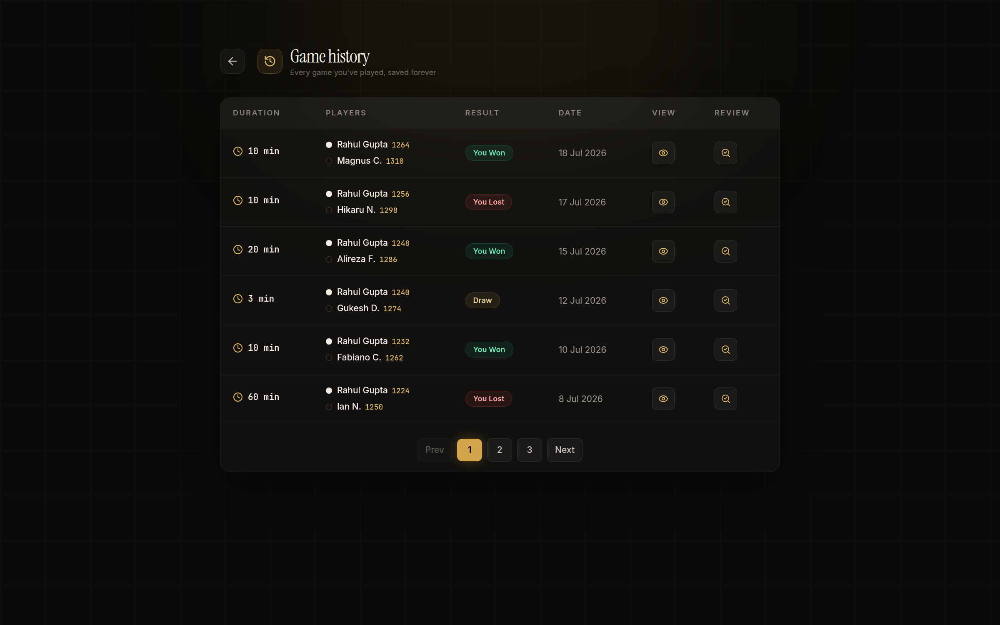
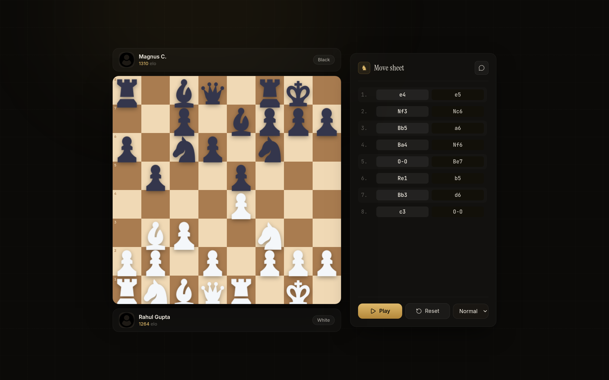
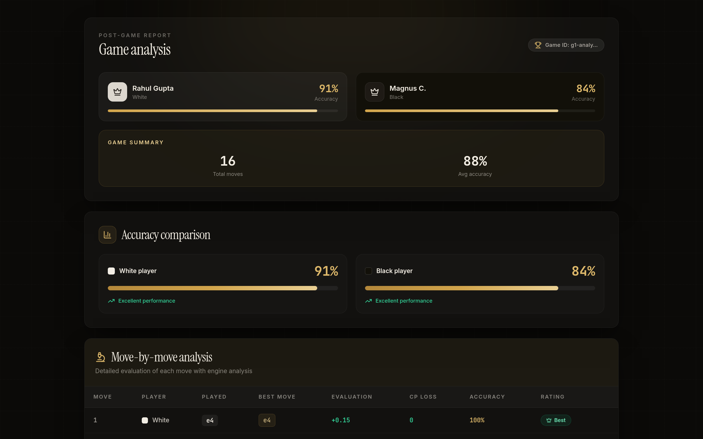

# Chess Arena

A real-time chess application built with a modern full-stack architecture. This app offers smooth gameplay, AI opponent integration, and robust move management with persistent clocks—even if users disconnect or leave the game.

## Screenshots

### Landing



### Sign in


### Play
| Lobby | Live game |
| --- | --- |
|  |  |



### Game history & replay
| Game history | Replay viewer |
| --- | --- |
|  |  |

### Stockfish game review


## Features

- **React + TypeScript** frontend for a responsive and interactive user interface.
- **Node.js** backend providing APIs and game logic coordination.
- **PostgreSQL** is used as the main database for persistent storage.
- **Redis** serves as an in-memory data store for fast retrieval and management of live chess moves and game states.
- Robust clock management that continues accurately even if a player disconnects or leaves.
- Ability for users to make moves seamlessly without backend issues.
- Game review features to analyze past games, powered by a Stockfish-based move analyzer.
- Integration with Google OAuth for user authentication.
- Reconnection capabilities to restore game state if a player disconnects.

## Demo Video

**UI walkthrough (2026 redesign):** [▶ demo/ui-demo.mp4](demo/ui-demo.mp4) — a ~1 minute tour through the landing page, sign-in, live game with synced clocks, winner modal, game history, replay viewer and Stockfish game review.

**Original full demo:**

[](https://drive.google.com/file/d/1diFIrCZbyIIV7gwoPW-PINmcbxOMMTzn/view?usp=sharing)


## Architecture Overview

- **Frontend**: Built with React and TypeScript, delivering the chessboard UI, move inputs, and clocks.
- **Backend**: Node.js service handling game state management, move validation, clock synchronization, and communication with the database layers.
- **Database**: PostgreSQL for long-term game data persistence, player info, and stats.
- **Caching & Live State**: Redis stores ongoing game moves and time-related data for fast read/write to ensure smooth gameplay experience.

## Installation

There are two ways to run the app locally: with Docker (recommended, no manual environment setup) or manually.

### Option 1: Docker Setup

Requires [Docker](https://docs.docker.com/get-docker/) and Docker Compose.

1. Clone the repo
    ```bash
    git clone https://github.com/RahulGIT24/chess
    cd chess
    ```
2. Build and start every service (Postgres, Redis, backend, frontend) from the repo root
    ```bash
    docker compose up --build
    ```
    The backend image installs Stockfish, generates the Prisma client, and runs database migrations automatically on startup, so no manual setup is required.
3. Once the containers are up:
    - Frontend: [http://localhost:5173](http://localhost:5173)
    - Backend REST API: `http://localhost:5001`
    - Backend WebSocket server: `ws://localhost:5002`

`docker-compose.yml` already provides working default environment variables for local development, so you don't need to create any `.env` files for this option.

### Option 2: Manual Setup

#### Server Setup

1. Clone the repo
    ```bash
    git clone https://github.com/RahulGIT24/chess
    ```
2. Navigate to the backend directory
    ```bash
    cd server1
    ```
3. Install backend dependencies
    ```bash
    pnpm install
    ```
4. Create a `.env` file in the `server1` directory (see `.env.example`) with the following variables:
    | Variable | Description |
    | --- | --- |
    | `DATABASE_URL` | PostgreSQL connection string |
    | `REDIS_HOST` / `REDIS_PORT` | Redis connection details |
    | `CLIENT_URL` | Origin of the running frontend, used for CORS |
    | `JWT_SECRET` / `JWT_SECRET_REFRESH` | Secrets used to sign access/refresh tokens |
    | `STOCKFISH_PATH` | Path to a local Stockfish binary, used for game analysis |
5. Generate the Prisma client
    ```bash
    npx prisma generate
    ```
6. Run migrations to set up the database schema
    ```bash
    npx prisma migrate dev --name init
    ```
7. Build the backend
    ```bash
    pnpm run build
    ```
8. Start the backend server
    ```bash
    pnpm run dev
    ```

#### Client Setup
1. Navigate to the client directory
    ```bash
    cd client
    ```
2. Install client dependencies
    ```bash
    pnpm install
    ```
3. Create a `.env` file in the `client` directory (see `.env.sample`) with the following variables:
    | Variable | Description |
    | --- | --- |
    | `VITE_GOOGLE_CLIENT_ID` | Google OAuth client ID used for sign-in |
    | `VITE_SERVER_URL` | Base URL of the backend REST API |
    | `VITE_WS_URL` | URL of the backend WebSocket server |
4. Start the client
    ```bash
    pnpm run dev
    ```

> **Note:** if you're running the manual setup, make sure Stockfish is installed on your system and `STOCKFISH_PATH` in `server1/.env` points to it. The Docker setup already includes Stockfish in the backend image.

## Running Tests

Both the client and server use [Vitest](https://vitest.dev/). The server tests mock Redis, Prisma, and WebSocket connections, so no running database or Redis instance is required.

```bash
# server
cd server1
pnpm run test          # run once
pnpm run test:watch    # watch mode
pnpm run test:coverage # with coverage report

# client
cd client
pnpm run test
pnpm run test:watch
pnpm run test:coverage
```

Client tests additionally use [React Testing Library](https://testing-library.com/react) for component-level tests.

## Continuous Integration

`.github/workflows/ci.yml` runs on every push and pull request targeting `master`. It has two independent jobs:

- **server**: installs dependencies, generates the Prisma client, type-checks/builds, and runs the test suite.
- **client**: installs dependencies, lints, type-checks/builds, and runs the test suite.

Neither job requires a live database, Redis instance, or secrets to pass.
